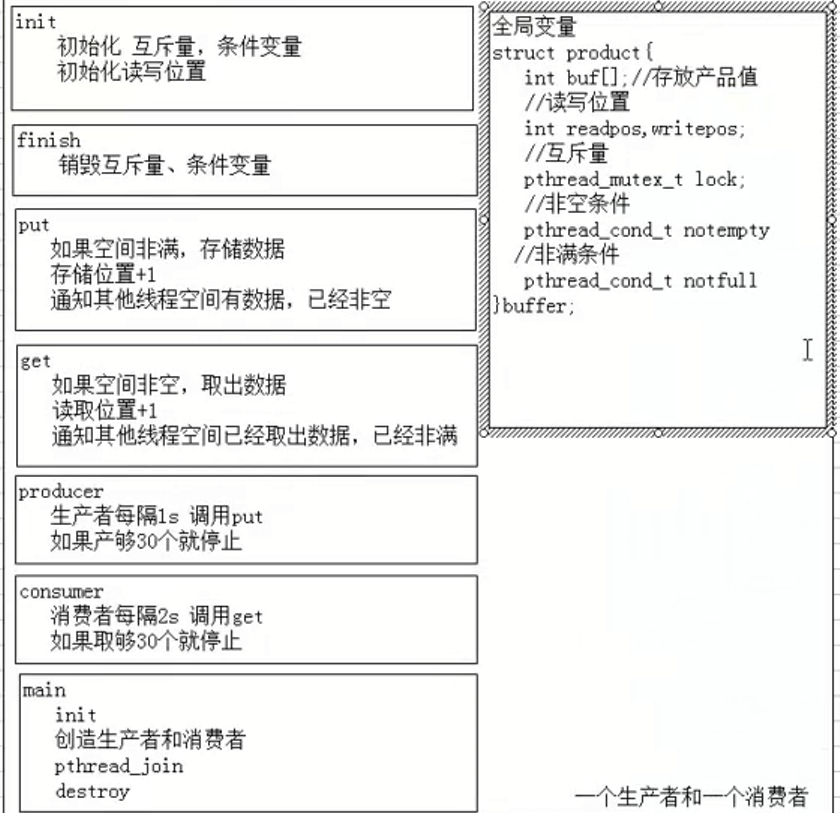

# 多线程

- 进程：一个正在执行的程序，它是**资源分配的最小单位**

进程中的事情需要按照一定顺序逐个执行，那么如何让一个进程中的一些事情同步执行


- 线程： 又称为轻量进程，**程序执行的最小单位**， 系统 **独立调度和分派cpu**的基本单位，是进程中的一个实体。
- 一个进程可以有多个线程，这些线程共享进程的所有资源，线程本身只包含一点必不可少的资源。

进程出现很多弊端，一是由于进程是资源拥有者，创建、撤销与切换存在较大的时空开销，因此需要引入轻型进程；二是由于对称多处理机（SMP）出现，可以满足多个运行单位，而多个进程并行开销过大。


## 操作系统的概念

### 并发

并发是指在同一时刻，只能有一条指令执行，但是多个进程被快速轮换执行，使得在宏观上具有多个进程同时执行的效果。 

在单核上看起来是同时发生。

### 并行

并行是指在同一时刻，有多条指令在多个处理器上同时执行

真正的同时发生

### 同步

同步：彼此有依赖关系的调用不应该**同时发生**，而同步就是要阻止哪些**同时发生**的事情

### 异步

异步： 和同步相对，任何两个独立的操作都是异步的，它表明事情独立的发生


## 多线程的好处

1. 在多处理器中开发程序的并行性
2. 在等待慢速IO操作时，程序可以执行其他操作，提高并行性
3. 模块化的编程，能更清晰的表达程序中独立事件的关系，结构清晰
4. 占用较少的系统资源

**多线程不一定要多处理器**


#  线程的创作和生命

## 创造新线程

### 线程id

- 对比


|            |             线程             |        进程         |
| :--------: | :--------------------------: | :-----------------: |
| 标识符类型 |           pthead_t           | pid_t(unsigned int) |
|   获取id   | pthread_t pthread_self(void) |      getpid()       |
|    创建    |       pthread_create()       |       fork()        |

pthread_t:在freeBSD5.2和mac下的是**结构体**在linux下是**unsigned long** (/usr/include/bits/pthreadtypes.h)

### 创建线程 pthread_create

```c
#include <pthread.h>

int pthread_create(pthread_t *restrict tidp,
                  const pthread_attr_t *restrict altr,
                  void *(*start_routine)(void*),
                  void *restrict arg);
//tidp:新线程的id，如果成功则新线程的id会回填到tidp指向的内存
//altr: 线程属性（调度策略，继承性，分离性...)
// 回调函数(新线程要执行的函数)
//arg:回调函数的参数， 可以用结构体

//return: 成功0 失败返回错误码
```


//ps:对`void*(*start_routine)(void*)`的理解

一个指向形参为`void*`类型，返回类型为`void*`类型的函数的指针，指针名是start_routine。

### example

```c
#include <stdio.h>
#include <pthread.h>
#include <stdlib.h>

void return_id(void)
{
	pid_t pid;
	pthread_t tid;

	pid = getpid();
	tid = pthread_self();
	printf("pid_t is %u, pthread_t is %x\n",pid, tid);
	return;
}

void *func(void *msg)
{
	printf("other thread\n");
	return_id();
	return (void*)0;
}

int main()
{
	pthread_t tid;
	int err;
	err = pthread_create(&tid, NULL, func, NULL);
	if (err != 0)
	{
		printf("pthread_create failure\n");
		return -1;
	}
	printf("main thread\n");
	return_id();
	sleep(3);
	return 0;
}
```


## 线程的生命周期

### 初始线程/主线程

1. main函数首先运行，在线程代码种，这个特殊的执行流被称作**初始线程**或**主线程**。可以在主线程中做任何普通线程可以做的事
2. 主线程的特殊性在于，在main函数返回的时候，会导致进程结束，进程内所有的线程也将会结束。可以在主线程中调用 `pthread_exit`函数，这样进程就会等待所有线程结束时才终止
3. 主线程接收的参数的方式是argc，argv，普通的线程只有一个void*
4. 在绝大多数情况下，主线程在默认堆栈上运行，可以增长到足够的长度。普通线程的堆栈是受限制的，溢出会产生错误

### 主线程的创建

1. 主线程是随着进程的创建而创建
2. 其他线程主要通过调用pthread_create
3. 新线程可能在当前进程调用pthread_create前就在运行，甚至在后者返回前就运行完毕

### example

```c
#include <stdio.h>
#include <string.h>
#include <pthread.h>
#include <stdlib.h>

struct person
{
	char name[10];
	unsigned int age;
};

void *func(void *person)
{
	sleep(1);
	printf("person name is %s, age is %u\n",
	((struct person *)person)->name, ((struct person*)person)->age);
	return (void *)0;
}
int main(int ac, char **av)
{
	pthread_t tid;
	int err;
	int *val; //for pthread_exit()
	struct person one;
	memcpy(one.name, "LEE", 10);
	one.age = 20;
	err = pthread_create(&tid, NULL, func, (void*)&one);
	if (err != 0)
	{
		printf("pthread_create failure\n");
		return -1;
	}
	printf("main thread\n");
	pthread_exit(val);
	return 0;
}

```


### 线程的四个基本状态


- 就绪
  - 当线程刚被创建时
  - 当线程被解除阻塞后
  - 就绪的线程在等待一个可用的处理器，当一个运行的线程被抢占时，立刻回到就绪状态
- 运行
  - 当处理器选中一个就绪的线程执行时，立刻变成运行状态
- 阻塞
  - 视图加锁一个已经被锁住的互斥量
  - 等待某个条件变量
  - 调用sigwait等待尚未发生的信号
  - 执行无法完成的I/O信号
  - 内存页错误
- 终止
  - 线程通常由于启动函数返回终止自己
  - 调用pthread_exit
  - 取消线程


### 终止

- 线程的分离
  - 分离一个正在运行的线程并不会影响它，仅仅是通知当前系统当该线程结束时，其所属的资源可以回收
  - 未被分离的线程在终止时会保留它的虚拟内存，包括他们的堆栈和其他系统资源，有时这种线程被称为僵尸进程
  - **创建线程时默认是非分离的**
- 回收
  - 如果线程具有分离属性，线程终止时会立刻回收。
  - 回收将释放所有在线程终止时未释放的系统资源和进程资源，包括保存线程返回值的内存空间、堆栈、保存寄存器的内存空间等
  - **但是必须释放由线程占有的程序资源**
    - malloc和mmap分配的资源可以**在任何时候由任何线程释放**
    - 条件变量，忽视了，信号灯可以由任何线程销毁，**只要被解锁或者无线程等待**
    - **但是只有互斥量的主人才能解锁它，所以在线程终止前，需要解锁互斥量**


# 线程的基本控制

## 线程的终止

### 注意exit

如果进程中任意一个线程调用了exit，_Exit(), _exit()，**那么整个进程将会终止**

### 不终止进程的退出方式

普通的单个线程

1. 从启动例程中返回，返回值是线程的退出码
2. 线程可以被同一进程中的其他线程取消
3. 线程调用pthread_exit(void *rval)函数，rval是退出码

#### example

```c
#include <stdio.h>
#include <pthread.h>
#include <string.h>
#include <stdlib.h>

void *func(void *command)
{
	if (strcmp("a", (char*)command) == 0)
	{
		printf("return\n");
		return (void*)0;
	}

	if (strcmp("b", (char*)command) == 0)
	{
		printf("pthread_exit\n");
		pthread_exit((void*)1);
	}
	
	if (strcmp("c", (char *)command) == 0)
	{
		printf("exit\n");
		exit(0);
	}

}
int main(int ac, char **av)
{

	pthread_t tid;
	int err;
	err = pthread_create(&tid, NULL, func, (void*)av[1]);
	if (err != 0)
	{
		printf("pthread_create failre\n");
		return -1;
	}
	printf("main thread\n");
	sleep(1);
	return 0;
}

```


### 线程连接 pthread_join

调用该函数的线程会一直阻塞，直到指定的线程调用pthread_exit，从启动例程返回或被取消

```c
#include <pthread.h>

int pthread_join(pthread_t tid, void *rval);

//tid:指定线程的id
//rval:指定线程的返回码，如果线程被取消，rval被置为PTHREAD_CANCLED

//return : 成功0 失败错误码
```


调用pthread_join会使**指定的线程处于分离状态**，如果指定线程已经处于分离状态，那么调用就会失败

pthread_detach可以分离一个线程，线程可以自己分离自己

`int pthread_detach(pthread_t thread);`


#### example

```c
#include <stdio.h>
#include <pthread.h>


void *func_return(void * mes)
{
	printf("func_return \n");
	return (void*)11;
}

void *func_exit(void *mes)
{
	printf("func_exit\n");
// 	pthread_detach(pthread_self()); //会让pthread_join失败
	pthread_exit((void*)22);
	
}
int main(void)
{
	pthread_t tid_return, tid_exit;
	void *rval;
	int err;

	err = pthread_create(&tid_return, NULL, func_return, NULL);
	if (err != 0)
	{
		printf("pthread_create tid_return failure\n");
		return -1;
	}
	err = pthread_create(&tid_exit, NULL, func_exit, NULL);
	if (err != 0)
	{
		printf("pthread_create tid_exit failure\n");
		return -2;
	}
	
	err = pthread_join(tid_return, &rval);
	if (err != 0)
	{
		printf("pthread_join tid_return failure\n");
		return -3;
	}
	printf("tid_return join return  is %d\n", err);
	printf("tid_return rval is %d\n", (int*)rval);
	err = pthread_join(tid_exit, &rval);
	if (err != 0)
	{
		printf("pthread_join tid_return failure\n");
		return -3;
	}

	printf("tid_exit join return  is %d\n", err);
	printf("tid_exit rval is %d\n", (int*)rval);

	return 0;
}

```


### 线程取消

#### 取消函数 pthread_cancel

```c
int pthread_cancel(pthread_t tid);

//return: 成功0
```

取消tid指定的线程，取消仅仅是发送请求，并不意味着等待线程终止，而且发送成功也不意味着tid一定会终止

#### 取消状态 pthread_setcancelstate

取消状态就是线程对取消信号的处理方式，忽略或响应。

线程创建时默认响应取消信号

```c
int pthread_setcancelstate(int state, int *oldsate);

//state有两种值：PTHREAD_CANCEL_ENABLE(缺省值) PTHREAD_CANCEL_DISABLE
```

设置本线程对cancel信号的反应

分别表示收到信号后设为CANCEL状态和忽略CANCEL信号继续运行

old_state如果不为NULL则存入原来的cancel状态以便恢复

#### 取消类型 pthread_setcanceltype

取消类型，是线程对取消信号的相应方式，立即取消或延时取消。

线程创建时默认延时取消。

```c
int pthread_setcanceltype(int type, int *oldtype);

//type: PTHREAD_CANCEL_DEFFERED 和PTHREAD_CANCEL_ASYNCHRONOUS
//表示 收到信号后继续运行至下一个取消点再退出 立即执行取消动作（退出）
```

仅当PTHREAD_CANCEL_ENABLE时有效

oldtype如果不为NULL则存入原来的取消动作类型值

#### 取消点

取消一个线程，它通常需要被取消线程的配合

线程在很多时候会查看自己是否有取消请求，如果有就主动退出，这些查看是否有取消的地方就是取消点。


很多地方都是包含取消点

pthread_join()

pthread_testcancel()

pthread_cond_wait()

pthread_cond_timedwait()

sem_wait();

sigwait()

write()

read()

大多数会阻塞的系统调用


#### example

```c
#include <stdio.h>
#include <pthread.h>

void *func(void *msg)
{
	int state;
	int type;
	state = pthread_setcancelstate(PTHREAD_CANCEL_DISABLE, NULL);
	printf("other thread is already cancel disable\n");

	printf("other thread sleep 4 seconds\n", i);
	sleep(4);
	//state = pthread_setcancelstate(PTHREAD_CANCEL_ENABLE, NULL); //到时vral 为 -1
	state = pthread_setcancelstate(PTHREAD_CANCEL_DISABLE, NULL); //到时rval 为 222

	printf("other thread is already cancel enable\n");
	
	type = pthread_setcanceltype(PTHREAD_CANCEL_ASYNCHRONOUS, NULL); //会立刻返回，下面的两句printf就无法输出，仅当PTHREAD_ENABLE生效
	printf("cancel point one\n");
	printf("cancel point two\n");
	
	return (void*)222;

}
int main(void)
{
	pthread_t tid;
	int err;
	int cval, jval;
	void **rval;
	err = pthread_create(&tid, NULL, func, NULL);
	if(err != 0)
	{
		printf("pthread  failed\n");
		return -1;
	}

	printf("pthread successful\n");
	cval = pthread_cancel(tid);  //请求取消
	if (cval != 0)
	{
		printf("pthread_cancel failed\n");
		return -2;
	}

	printf("pthread_cancel successful\n");
	jval = pthread_join(tid, rval);	//当前进程会阻塞，等待tid的线程pthread_exit.return.取消
	if (jval != 0)
	{
		printf("pthread_join failed\n");
		return -3;
	}
	printf("pthread_join successful\n");
	printf("jval is %d\n", jval);
	printf("rval is %d\n", (int*)(*rval));
	
	printf("wait two second\n");
	sleep(2);

	printf("main is before return 0\n");
	return 0;
}
```


### 向线程发送信号

#### pthread_kill

```c
#include <signal.h>
int pthread_kill(pthread_t thread, int sig);
//return: 成功0， 出错错误码
```

向指定线程发送sig信号，如果线程代码内不作处理，则按照信号默认的行为影响整个进程，比如发送SIGUSR1，则默认退出进程

如果要获得正确的行为，则要在线程内实现sigaction

**sig不为0，则必须在线程内实现信号处理函数，否则会影响整个进程**

**sig为0，用于判断进程是否存活**

##### example

```c
#include <stdio.h>
#include <signal.h>
#include <pthread.h>
#include <errno.h>
void *func1(void *msg)
{
	printf("i am other thread\n");
	return (void*)222;
	
}


void *func2(void *msg)
{
	sleep(1);
	printf("i am other thread two\n");
	return (void *)333;
}
int main()
{
	pthread_t tid1, tid2;
	int err;
	void *rval;
	//thread one
	err = pthread_create(&tid1, NULL, func1, NULL);
	if (err < 0)
	{
		printf("pthread_create failed\n");
		return -1;
	}
	
	sleep(1);
	err = pthread_kill(tid1, 0);
	if (err == ESRCH)
		printf("tid1 thread not found\n"); //1s后tid1结束，会打印这句
	else
		printf("tid2 thread are found\n");

	//thread two
	err = pthread_create(&tid2, NULL, func2, NULL);
	if (err < 0)
	{
		printf("tid2 pthread_create failed\n");
		return -1;
	}
	
	err = pthread_kill(tid2, 0);
	if (err == ESRCH)
		printf("tid2 thread not found\n");
	else
		printf("tid2 thread are found\n"); //由于tid2等待了1s，所以打印这个

	err = pthread_kill(tid2, SIGQUIT); //func2没有sigaction，会直接退出，不会打印main function over
	

	pthread_join(tid2, &rval); //等待tid2，否则直接main函数退出
	printf("rval is %d\n", (int*)rval);

	//over
	printf("main function over\n");
	return 0;
}
```


#### 信号处理 sigaction

- 进程信号处理

```c
int sigaction(int signum, const struct sigaction *act, struct sigaction *oldact);

/*
struct siaction
{
	...
	act.sa_mask 信号屏蔽字
	act.sa_handler 信号集处理程序
	... 
}
```


```c
int sigemptyset(sigset_t *set); //清空信号集
int sigfillset(sigset_t *set);	//将所有信号加入信号集
int sigaddset(sigset_t *set, int signum); //增加一个信号到信号集
int sigdelset(sigset_t *set, int signum); // 删除一个信号到信号集
```


- 多线程信号屏蔽处理

  ```c
  //int sigprocmask(int how, const sigset_t *set, sigset_t *oldset); // 已失效
  
  int pthread_sigmask(int how, const sigset_t *set, sigset_t *oldset);
  // how: SIG_BLO.sa_miaCK 向当前的信号掩码中添加set，其中set表示要阻塞的信号组
  //		SIG_UNBLOCK 向当前的信号掩码中删除set， 其中set表示要取消阻塞的信号组
  //		SIG_SETMASK 向当前的信号掩码替换为set， 其中set表示新的信号掩码
  
  //return： 成功0 出错错误码
  ```

  在多线程中，新线程的当前信号掩码会继承创造它的那个线程的信号掩码

  一般情况下，被阻塞的信号将不能终端此线程的执行，除非此信号的产生是因为程序运行出错，比如SIGSEGV

  另外不能忽略处理的信号SIGKILL和SIGSTOP，这两个也不能被阻塞


##### example

```c
#include <stdio.h>
#include <pthread.h>
#include <signal.h>

void sig_handler1(int arg)
{
	printf("new thread a\n");
	printf("remember only the last sigaction function alway be run");
	return;
}

void sig_handler2(int arg)
{
	printf("new thread b\n");
	printf("remember only the last sigaction function alway be run");
	return;
}

void *thread1(void *msg)
{
	printf("thread1\n");
	struct sigaction act;
	//init
	sigaddset(&act.sa_mask, SIGQUIT); //信号屏蔽字
	act.sa_handler = sig_handler1;//信号集处理函数
	//注册
	sigaction(SIGQUIT,&act, NULL ); 

	//多线程屏蔽处理
	pthread_sigmask(SIG_BLOCK, &act.sa_mask, NULL);

	sleep(1);
}


void *thread2(void *msg)
{
	printf("thread2\n");
	struct sigaction act;
	//init
	sigaddset(&act.sa_mask, SIGQUIT); //信号屏蔽字
	act.sa_handler = sig_handler2;//信号集处理函数
	//注册
	sigaction(SIGQUIT,&act, NULL ); 

	//多线程屏蔽处理
	//pthread_sigmask(SIG_BLOCK, &act.sa_mask, NULL);

	sleep(1);
}

int main()
{
	pthread_t tid1, tid2;
	int err;
	int ret;

	err = pthread_create(&tid1, NULL, thread1, NULL);
	if (err != 0)
	{
		printf("tid1 create failed\n");
		return -1;
	}

	err = pthread_create(&tid2, NULL, thread2, NULL);
	if (err != 0)
	{
		printf("tid2 create failed\n");
		return -1;
	}
	sleep(1);

	ret = pthread_kill(tid1, SIGQUIT);
	if (ret != 0)
	{
		printf("send signal to tid1 failed\n");
		return -2;
	}
	ret = pthread_kill(tid2, SIGQUIT);
	if (ret != 0)
	{
		printf("send signal to tid2 failed\n");
		return -2;
	}
    
// 防止退出程序
	ret = pthread_join(tid1, NULL);
	if (ret != 0)
	{
		printf("pthread_join tid1 failed\n");
		return -3;
	}
	ret = pthread_join(tid2, NULL);
	if (ret != 0)
	{
		printf("pthread_join tid2 failed\n");
		return -3;
	}
	printf("main over\n");
	return 0;

}

```

运行


注意sigaction和signal一样，是响应最后一个调用他们的，所以上面会出现不同结果

### 清除操作

#### 注册/销毁清理函数

线程可以安排它退出的清理操作，这和进程可以用atexit函数安排进程退出时需要调用的函数类似

这称为**线程清理处理程序**。


线程可以建立多个清理处理程序，处理程序记录在栈中，处理程序执行的顺序与他们注册的顺序相反。


```c
void pthread_cleanup_push(void (*rtn) (void*), void *args); //注册处理程序
void pthread_cleanup_pop(int excute); //清除处理程序
```

**需要成对出现**


- 当执行以下操作时调用清理函数，清理函数的参数由args传入

  1. 调用pthread_exit
  2. 响应取消请求
  3. 用非零参数调用pthread_cleanip_pop

  - execute参数设置为0，清理函数将不被调用。
  - 不管发生上诉那种情况，**pop都将删除push调用建立的清理处理程序**。


  - push进去的函数可能在以下三个时机执行：

    1. 显示的调用pthread_exit();

    2. 在cancel点线程被cancel。
    3. pthread_cleanup_pop()的参数不为0时。


  ##### example

  ```c
  #include <stdio.h>
  #include <pthread.h>
  
  void *func1(void *arg)
  {
  	printf("rtn 1 with argument is %s\n", (char*)arg);
  	return(void*)0;
  	
  }
  
  void *func2(void *arg)
  {
  	printf("rtn 2 with argument is %s\n", (char*)arg);
  	return(void*)0;
  	
  }
  
  void *func3(void *arg)
  {
  	printf("rtn 3 with argument is %s\n", (char*)arg);
  	return(void*)0;
  	
  }
  void *thread1(void *msg)
  {
  	printf("thread1~\n");
  	pthread_cleanup_push(func1, (void*)"thread1 and 1"); 
  	pthread_cleanup_push(func2, (void*)"thread1 and 2"); 
  	pthread_cleanup_push(func3, (void*)"thread1 and 3"); 
  
  	pthread_cleanup_pop(4); //数字无所谓
  	pthread_cleanup_pop(0); 
  	pthread_cleanup_pop(2); 
  	
  //	return (void*)22;
  	pthread_exit((void*)22);
  }
  
  
  void *thread2(void *msg)
  {
  	printf("thread2~\n");
  	pthread_cleanup_push(func1, (void*)"thread2 and 1"); 
  	pthread_cleanup_push(func2, (void*)"thread2 and 2"); 
  	pthread_cleanup_push(func3, (void*)"thread2 and 3"); 
  
  	pthread_cleanup_pop(4);
  	pthread_cleanup_pop(0); 
  	pthread_cleanup_pop(2);
  	
  	//return (void*)33;
  	pthread_exit((void*)33);
  }
  
  int main(void)
  {
  	pthread_t tid1, tid2;
  	int err;
  	err = pthread_create(&tid1, NULL ,thread1, NULL);
  	if (err != 0)
  	{
  		printf("tid1 create failed\n");
  		return -1;
  	}
  	err = pthread_create(&tid2, NULL ,thread2, NULL);
  	if (err != 0)
  	{
  		printf("tid2 create failed\n");
  		return -1;
  	}
  	sleep(1);
  	return 0;
  }
  
  ```


  -  ps

  编译时出现

  ```shell
   error: expected ‘while’ before ‘void’
   void *thread2(void *msg)
  ```

  时，**说明push和pop可能没有成对或者写错**


# 线程的同步

## 互斥量

### 为什么要使用互斥量

当多个线程共享相同的内存时，需要每个线程看到相同的视图。当一个线程修改变量时，而其他线程也可以读取或者修改这个变量，就需要对这些线程同步，确保他们不会访问到无线的变量。


在变量修改时间多于一个存储器访问周期的处理器结构中，当存储器的读和写这两个周期交叉时，这种潜在的不一致性就会出现。当然这和处理器相关，但是在可移植的程序中并不能对处理器做出任何假设。


### 互斥锁的初始化和销毁

为了让线程访问数据不产生冲突，这就需要对变量加锁，使得同一时刻只有一个线程可以访问变量

互斥量本质就是所，访问共享资源前对互斥量加锁，访问完成后解锁。


当互斥量加锁以后，其他所有需要访问该互斥量的线程都将阻塞


当互斥量加锁以后，所有因为这个互斥量阻塞的线程都将变为就绪态，第一个获得cpu的线程会获得互斥量，变为运行态，而其他线程会继续变为阻塞，在这种方式下访问互斥量每次只有一个线程能向前执行


#### pthread_mutex_init pthread_mutex_destory

- 互斥量用`pthread_mutex_t`类型的数据表示，在使用之前需要对互斥量初始化(/usr/include/bits/pthreadtypes.h)

  - 如果是动态分配的互斥量，可以调用`pthread_mutex_init()`函数初始化

  - 如果是静态分配的互斥量，还可以把它置为常量 `PTHREAD_MUTEX_INITALIZER`

    ```c
    pthread_mutex_t mutex =  PTHREAD_MUTEX_INITALIZER;
    ```

  - 动态分配的互斥量在释放内存之前需要调用 `pthread_mutex_destory（）`

```c
int pthread_mutex_init(pthread_mutex_t *restrict mutex, const pthread_mutextattr_t *restrict attr);

//mutext: 将要初始化的互斥量
//attr: 互斥量的属性，默认为NULL

int pthread_mutex_destroy(pthread_mutext_t *mutex);
```


### 加锁和解锁

#### 加锁 pthread_mutex_lock pthread_mutex_tryloc

```c
int pthread_mutex_lock(pthread_mutex_t *mutex);
//return ：成功0， 失败错误码
```

如果互斥量已经被锁住，那么就导致该线程阻塞


```c
int pthread_mutex_tryloc(pthread_mutex_t *mutex);
//return: 成功0 失败错误码
```

如果互斥量已经被锁住，不会导致线程阻塞


### 死锁

```c
int pthread_mutex_unlock(pthread_mutex_t *mutex);
//return: 成功0 失败返回错误码
```

### example

```c
#include <stdio.h>
#include <pthread.h>
#include <signal.h>

struct person
{
	int age;
	int money;
	int num;
};

pthread_mutex_t mutex;
int i, j;

struct person Lee;

void *thread1(void *msg)
{
	int i;
	pthread_mutex_lock(&mutex);
	while(1)
	{
		Lee.age = i;
		Lee.money = i;
		Lee.num = i;
		i++;
		if (Lee.age != Lee.money || Lee.age != Lee.num || Lee.num != Lee.money)
		{	
			printf("thread1 age and money not same, age is %d , money is  %d, num is %d\n", Lee.age, Lee.money, Lee.num);
			break;
		}
	}
	pthread_mutex_unlock(&mutex);
	return (void*)2;

}
void *thread2(void *msg)
{
	int i;
	pthread_mutex_lock(&mutex);
	while(1)
	{
		Lee.age = i;
		Lee.money = i;
		Lee.num = i;
		i++;
		if (Lee.age != Lee.money || Lee.age != Lee.num || Lee.num != Lee.money)
		{	
			printf("thread1 age and money not same, age is %d , money is  %d, num is %d\n", Lee.age, Lee.money, Lee.num);
			break;
		}
	}
	pthread_mutex_unlock(&mutex);
	return (void*)2;

}
int main(void)
{
	pthread_t tid1, tid2;
	int err;
	err = pthread_mutex_init(&mutex, NULL);
	if (err != 0)
	{
		printf("pthread_mutex_init failed\n");	
		return -1;
	}

	err = pthread_create(&tid1, NULL, thread1, NULL);
	if (err != 0)
	{
		printf("pthread_create 1 failed\n");
		return -2;
	}
	err = pthread_create(&tid2, NULL, thread2, NULL);
	if (err != 0)
	{
		printf("pthread_create 2 failed\n");
		return -2;
	}

	pthread_join(tid1, NULL);
	pthread_join(tid2, NULL);
	
	return 0;
}
```


## 读写锁

### 什么是读写锁，它与互斥锁的区别

和互斥量类似，不过读写锁有 **更高的并行性**

互斥量要么加锁要么不加锁，而且同一时刻只允许一次线程对其加锁。对于一个变量的读取，完全可以让多个线程同时进行操作

`pthread_rwlock_t rwlock`

读写锁有三种状态，读模式下加锁，写模式下加锁，不加锁。

一次只有一个线程可以占有写模式下的读写锁，但是多个线程可以同时占有读模式的读写锁


读写锁有三种状态，在它被解锁之前，所有试图对这个锁加锁的线程都会阻塞。

读写锁在读加锁状态时，所有试图以读模式对其加锁的线程都会获得访问权，但是如果线程希望以写模式对其加锁，它必须阻塞直到所有的线程释放锁


当读写锁的读模式加锁时，如果有线程试图以写模式对其加锁，那么读写锁会阻塞随后的读模式锁请求。

这样可以避免读锁长期占用，而写锁达不到请求。


读写锁非常适合对数据结构读次数大于写次数的程序，当它以读模式锁住时，是以共享的方式锁住的；当它以写模式锁住时，是以独占的模式锁住的。

### 读写锁的初始化和销毁 

#### pthread_rwlock_init pthread_rwlock_destory

```c
//初始化
int pthread_rwlock_init(pthread_rwlock_t *restrict rwlock, const pthread_rwlockattr_t *restrict attr);

//销毁
int pthread_rwlock_destroy(pthread_rwlock_t *rwlock);

//return: 成功0 失败出错码
```


### 加锁和解锁

#### 读模式

```c
int pthread_rwlock_rdlock(pthread_rwlock_t *rwlock);
int pthread_rwlock_tryrdlock(pthread_rwlock_t *rwlock);
```


#### 写模式

```c
int pthread_rwlock_wrlock(pthread_rwlock_t *rwlock);
int pthread_rwlock_trywrlock(pthread_rwlock_t *rwlock);
```


#### 解锁

```c
int pthread_rwlock_unlock(pthread_rwlock_t *rwlock);
```


## 条件变量

#### 条件变量的引入

当互斥量被锁住以后发现当前线程还是无法完成自己的操作，那么它应该释放互斥量，让其他线程工作

1. 采用轮训的方式，不停的查询所需要的条件
2. 让系统来帮忙查询条件，使用条件变量 `pthread_cond_t cond`

#### 条件变量的初始化和销毁

##### 初始化

1. `pthread_cond_t cond = PTHREAD_COND_INITIALIZER;`

2. ```c
   int pthread_cond_init(pthread_cond_t *restrict cond, const pthread_condattr_t *restrict attr);
   
   //默认属性为NULL
   ```

##### 销毁

```c
int pthread_cond_destory(pthread_cond_t *cond);
```


#### 条件变量的使用

**需要配合互斥量**

```c
int pthread_cond_wait(pthread_cond_t *restrict cond, pthread_mutex_t *restrict mutex);
```

1. 使用pthread_cond_wait等待条件变为真。传递给pthread_cond_wait的互斥量对条件进行保护，调用者把锁住的互斥量传递给函数。
2. 这个函数将线程放到等待条件的线程列表上，然后对互斥量进行解锁，这是原子操作。当条件满足时这个函数返回，返回以后继续对互斥量加锁。


```c
int pthread_cond_timedwait(pthread_cond_t *restrict cond, pthread_mutex_t *restrict mutex, const struct timespec *restric abstime);
```

1. 和 pthread_cond_wait类似，只是多一个timeout，如果到了指定的时间还不满足，那么就返回。

2. 时间用以下的结构表示

   ```c
   struct timespec{
       time_t tv_sec;
       long tv_nsec;
   };
   ```

   **这是绝对时间。将当前时间加上需要的时间然后转换timespec，而不是将需要时间直接转换到timespec**


当条件满足时，需要唤醒等待条件的线程

```c
int pthread_cond_broadcast(pthread_cond_t *cond);
int pthread_cond_siganl(pthread_cond_t *cond);
```

1. pthread_cond_broadcast 唤醒等待条件的所有线程
2. pthread_cond_siganl至少唤醒等待条件的第一个线程

**注意，一定要在条件改变以后再唤醒线程**


#### example

框架



代码

```c
include <stdio.h>
#include <pthread.h>

#define PRODUCT_CNT 30
#define BUFSIZE 5

struct product
{
	int buf[LENGTH]; //存放产品值
	int readpos, writepos; //读写位置
	pthread_mutex_t lock; //互斥量
	pthread_cond_t notempty; //条件变量 非空
	pthread_cond_t notfull;  //条件变量 非满
	
}buff;

void init(struct product *p)
{
	pthread_mutex_init(&(p->lock), NULL);
	
	pthread_cond_init(&(p->notempty), NULL);
	pthread_cond_init(&(p->notfull), NULL);

	p->readpos = 0;
	p->writepos = 0;

}

void finish(struct product *p)
{
	pthread_mutex_destroy(&(p->lock));
	pthread_cond_destroy(&(p->notempty));
	pthread_cond_destroy(&(p->notfull));
	p->readpos = 0;
	p->writepos = 0;
}


void put(struct product *p, int data)
{
	pthread_mutex_lock(&(p->lock));
	if ((p->writepos+1) % BUFSIZE == p->readpos) //生成BUFSIZE-1个就停
	{
		printf("producter wait until product is sell\n");
		pthread_cond_wait(&(p->notfull), &(p->lock));
	}

	p->buf[p->writepos] = data;
	p->writepos++;

	if (p->writepos >= BUFSIZE)
		p->writepos = 0;

	pthread_cond_signal(&(p->notempty)); //唤醒需要notempty的线程
	pthread_mutex_unlock(&(p->lock));	

}

int get(struct product *p)
{

	pthread_mutex_lock(&(p->lock));
	if (p->writepos == p->readpos)
	{
		printf("product is empty, wait for product\n");
		pthread_cond_wait(&(p->notempty), &(p->lock));
	}

	int data = p->buf[p->readpos];
	p->readpos++;

	if (p->readpos >= BUFSIZE)
		p->readpos = 0;

	pthread_cond_signal(&(p->notfull)); // 唤醒需要notempty的线程
	pthread_mutex_unlock(&(p->lock));

	return data;
}
void *producter(void *msg)
{
	int i = 0;
	for (; i<15; i++)
	{
		sleep(1);
		printf("product %d is ready\n", i);
		put(&buff, i);
		printf("product %d is over\n", i);
	}
	printf("producter over\n");
	return (void *)1;
}

void *customer(void *msg)
{
	static int i = 0;
	int product_num;
	while(1)
	{

		sleep(2);
		printf("ready to get \n");
		product_num = get(&buff);
		printf("get product %d is over\n", product_num);
		if (++i == PRODUCT_CNT)
		{
			printf("is limit\n");
			break;
		}
	}
	printf("customer over\n");
	return (void*)3;
}

int main(void)
{
	pthread_t procid, cussid;
	pthread_create(&procid, NULL, producter, NULL);
	pthread_create(&cussid, NULL, customer, NULL);

	init(&buff);

	pthread_join(procid, NULL);
	pthread_join(cussid,NULL);

	finish(&buff);

	return 0;

}

```


# linux线程高级控制

## 线程的高级属性

### 一次性初始化

有些事情需要且只要执行一次（比如互斥量初始化）

通常当初始化应用程序时，可以比较容易地将其放在main函数中

但当你写一个库函数，就不能在main函数中初始化了

可以使用 **静态初始化**，**但是使用一次初始（pthread_one_t）会比较容易**


首先要定义一个pthread_once_t变量，这个变量要用宏PTHREAD_ONCE_INIT初始化。

然后创建一个与控制变量相关的初始化函数

```c
pthread_once_t once_control = PTHREAD_ONCE_INIT; //设置为0
void init_routine()
{
    //初始化互斥量
    //初始化读写锁
    ...
}
```

接下来就可以在任何时刻调用pthread_once函数

```c
int pthread_once(pthread_once_t *once_control, void(*init_routine)(void));
// 功能： 本函数使用初值为PTHREAD_ONCE_INIT的once_control变量保证init_routine()函数在本进程执行序列中仅执行一次。
```

**在多线程编程环境下，尽管pthread_once()调用会出现在多个线程中，init_routine()函数仅执行一次，究竟在哪个线程中执行是不定的，是由内核调度来决定**


linux threads使用互斥锁和条件变量保证由pthread_once()指定的函数执行且只执行一次

一次性函数的执行状态由三种： NEVER(0), IN_PROGRESS(1). DONE(2),用once_control来表示pthread_once()的执行状态：

1. 如果once_control初值为0， 那么pthread_once从未执行过，init_routine()函数会执行
2. 如果once_control初值为1，则由于所有pthread_once()都必须等待其中一个激发“已执行一次”信号，因此所有的pthread_once()都会陷入永久的等待中，init_routine()就无法执行
3. 如果once_control设置为2，则表示pthread_once()函数已执行过一次，从而所有pthread_once()则会立即返回，init_routine()就没有机会执行
4. 当pthread_once()函数成功返回，once_control就会被设置为2


### 线程属性
#### 属性

##### 线程有哪些属性

线程的属性用pthread_attr_t类型的结构表示，在创建线程的时候可以不用传入NULL，而是传入一个pthread_attr_t结构，由用户自己来配置线程的属性


pthread_attr_t类型对应用程序是不透明的，也就是说应用程序不需要了解有关属性对象内部结构的任何细节，因而可以增加程序的可移植性


- 线程属性


|    名称     |                描述                |
| :---------: | :--------------------------------: |
| detachstate |           线程的分离状态           |
|  guardsize  | 线程栈末尾的警戒区域大小（字节数） |
|  stackaddr  |          线程栈的最低地址          |
|  stacksize  |       线程栈的大小（字节数）       |

**并不是所有的系统都支持线程的这些属性，因此需要检查当前系统是否支持设置的属性**

还有一些属性不包括在pthread_attr_t结构中，例如：线程的可取消状态，取消类型，并发度


##### 线程属性初始化和销毁

pthread_attr_t结构在使用之前需要初始化，使用之后需要销毁

- 初始化

  ```c
  int pthread_attr_init(pthread_attr_t *attr);
  ```

- 销毁

  ```c
  int pthread_attr_destory(pthread_attr_t *attr);
  ```


如果在调用pthread_attr_init初始化属性的时候分配了内存空间，那么pthread_attr_destory将释放内存空间。

除此之外，pthread_attr_destory还会用无效的值初始化pthread_attr_t对象，因此如果该属性对象被误用，会导致创建线程失败。


#### 线程的分离属性

##### 分离属性的概念

线程的分离

- 分离一个正在运行的线程并不会影响它，仅仅是通知当前系统当该线程结束时，其所属的资源可以回收

  未被分离的线程在终止时会保留它的虚拟内存，包括他们的堆栈和其他系统资源，有时这种线程被称为僵尸进程

  **创建线程时默认是非分离的**

- 如果线程具有分离属性，线程终止时会被立刻回收，**回收将释放掉所有在线程终止时未释放的系统资源和进程资源**，包括保存线程返回值的内存空间，堆栈，保存寄存器的内存空间等。

##### 分离属性的使用方法

如果在创建线程的时候不需要了解线程的终止状态，那么可以修改pthread_attr_结构体的detachstate属性，让线程以分离状态启动。可以使用pthread_attr_setdetachstate函数来设置线程的分离状态属性。

线程的分离属性detachstate有两种合法值：

`PTHREAD_CREATE_DETACHED` 分离的

`PTHREAD_CREATE_JOINABLE` 非分离的，可连接的

```c
int pthread_attr_setdetachstate(pthread_attr_t *attr, int detachstate);
int pthread_attr_getdetachstate(pthread_attr_t *attr, int *detachstate);
//pthread_attr_getdetachstate()可以获得线程的分离状态属性
```


设置线程分离属性的步骤

1. 定义线程属性变量pthread_attr_t attr
2. 初始化attr， pthread_attr_init（&attr）
3. 设置线程为分离或非分离pthread_attr_setdetachstate(&attr,detachstate)
4. 创建线程pthread_create(&tid,&attr， thread_fun，NULL);

所有的系统都支持线程的分离状态属性

##### 分离属性example

    #include <stdio.h>
    #include <pthread.h>
    
    void *thread1(void *msg)
    {
    	printf("thread 1 is beginning\n");
    	pthread_attr_t attr;
    	int mystate;
    	//获得分离属性
    	pthread_attr_getdetachstate((pthread_attr_t*)msg, &mystate);
    	printf("thread1 detachstate is %d\n", mystate);
    	printf("thread 1 is over\n");
    	return (void*)1;
    }
    void *thread2(void *msg)
    {
    	printf("thread 2 is beginning\n");
    	printf("thread 2 is over\n");
    	return (void*)1;
    }
    int main()
    {
    	pthread_t tid1, tid2;
    	int err;
    
    	//初始化属性变量
    	pthread_attr_t attr;
    	pthread_attr_init(&attr);
    
    	//设置分离属性
    	//pthread_attr_setdetachstate(&attr, PTHREAD_CREATE_DETACHED);
    	pthread_attr_setdetachstate(&attr, PTHREAD_CREATE_JOINABLE);
    	
    	int state_detached = PTHREAD_CREATE_DETACHED;
    	int state_joinable = PTHREAD_CREATE_JOINABLE;
    	printf("main : detached detachstate is %d\n", state_detached);
    	printf("main : joinable detachstate is %d\n", state_joinable);
    
    	err = pthread_create(&tid1, &attr, thread1,(void*)&attr);
    	if (err != 0)
    	{
    		printf("tid1 failed\n");
    		return -1;
    	}
    	err = pthread_create(&tid2, NULL, thread2, NULL);
    	if (err != 0)
    	{
    		printf("tid1 failed\n");
    		return -1;
    	}
    
    	err = pthread_join(tid1, NULL);
    	if (err != 0)
    	{
    		printf("tid1 joining failed\n");
    	//	return -2;
    	}


​    	
​    	err = pthread_join(tid2, NULL);
​    	if (err != 0)
​    	{
​    		printf("tid2 joining failed\n");
​    	//	return -2;
​    	}
​    	pthread_attr_destroy(&attr);
​    	return 0;
​    }
#### 线程栈属性

##### 线程的栈大小与地址

对于进程来说，虚拟地址空间的大小是固定的，进程中只有一个栈，因此它的大小通常不是问题

但是对于线程来说，同样的虚拟地址被所有的线程共享。

如果应用程序使用了太多的线程，导致线程栈累计超过可用的虚拟地址空间，这个时候就需要减少线程默认的栈大小。

如果线程分配了大量的自动变量或者线程的栈帧太深，那么这个时候需要的栈要比默认的大


如果用完了虚拟地址空间，可以使用malloc或者mmap来为其他栈分配空间，并修改栈的位置

- 修改栈属性

  ```c
  int pthread_attr_setstack(pthread_attr_t *attr, void *stackaddr, size_t stacksize);
  ```

- 获取栈属性

  ```c
  int pthread_attr_getstack(pthread_attr_t *attr, void**stackaddr, size_t *stacksize);
  ```

stackaddr是栈的内存单元最低地址，stacksize是栈的大小

*注意stackaddr并不一定是栈的开始，对于一些处理器，栈的地址是从高往低的，那么这时stackaddr是栈的结尾*


也可以单独获取或者修改栈的大小，而不去修改栈的地址

对于栈的大小设置，不能小于PTHREAD_STACK_MIN（#include <limits.h>）

```c
int pthread_attr_setstacksize(pthread_attr_t *attr, size_t stacksize);
int pthread_attr_getstacksize(pthread_attr_t *attr, size_t *stacksize);
```

对于栈大小的设置，在创建线程之后，还可以修改


**对于遵循POSIX标准的系统，不一定要支持线程的栈属性，因此需要检查**

1. 在编译阶段

   使用`_POSIX_THREAD_ATTR_STACKADDR` 和 `_POSIX_THREAD_ATTR_STACKSIZE`检查是否支持线程栈属性，这些宏定义在 `/usr/include/bits/posix_opt.h`

   使用`#inlcude<unistd.h>` 可包含

2. 在运行阶段

   使用 `_SC_THREAD_ATTR_STACKADDR`和 `_SC_THREAD_THREAD_ATTR_STACKSIZE`传递给sysconf函数检查系统对线程栈属性的支持

##### 栈尾警戒区

线程属性guradsize控制着线程栈末尾，以免栈溢出的扩展内存的大小，这个属性默认是PAGESIZE个字节。可以将其设置为0，这样就不会提供警戒缓冲区。

**如果 修改了stackaddr，系统认为是用户管理栈，警戒缓冲区会无效**


- 设置guardsize

  ```c
  int pthread_attr_setguardsize(pthread_attr_t *attr, size_t guardsize);
  ```

- 获取guardsize

  ```c
  int pthread_attr_getguardsize(pthread_attr_t *attr, size_t *guardsize);
  ```


##### 栈属性example

```c
#include <stdio.h>
#include <pthread.h>
#include <limits.h>
#include <unistd.h>
void *thread1(void *msg)
{
	printf("thread 2 is beginning\n");
	size_t stacksize;
	pthread_attr_getstacksize((pthread_attr_t*)msg, &stacksize);
	printf("thread2 stack's default is %d\n", stacksize);
#ifdef _POSIX_THREAD_ATTR_STACKSIZE	
	printf("change stack to PTHREAD_STACK_MIN\n");
	pthread_attr_setstacksize((pthread_attr_t*)msg, PTHREAD_STACK_MIN);
	pthread_attr_getstacksize((pthread_attr_t*)msg, &stacksize);
	printf("thread1 stack's PTHREAD_STACK_MIN is %d\n", stacksize);

	printf("change stack to PTHREAD_STACK_MIN-1\n");
	pthread_attr_setstacksize((pthread_attr_t*)msg, PTHREAD_STACK_MIN-1);
	pthread_attr_getstacksize((pthread_attr_t*)msg, &stacksize);
	printf("thread1 stack now is %d\n", stacksize);
#endif
	printf("thread 2 is over\n");
	return (void*)1;
}
int main()
{
	pthread_t tid1;
	int err;

	//初始化条件变量
	pthread_attr_t attr;
	pthread_attr_init(&attr);

	//设置分离属性
	pthread_attr_setdetachstate(&attr, PTHREAD_CREATE_JOINABLE); //未被分离
	err = pthread_create(&tid1, &attr, thread1, (void*)&attr);
	if (err != 0)
	{
		printf("tid1 failed\n");
		return -1;
	}

	err = pthread_join(tid1, NULL);
	if (err != 0)
	{
		printf("tid1 joining failed\n");
	//	return -2;
	}

	
	return 0;
}

```


### 线程的同步属性

#### 互斥量的属性

线程的同步信号量也有属性，比较重要的是进程共享属性和类型属性，以及优先级属性。

互斥量的属性用pthread_mutexattr_t类型的数据表示

##### 互斥量属性的初始化和销毁

- 初始化

  ```c
  int pthread_mutexattr_init(pthread_mutexaddr_t *attr);
  ```

- 销毁

  ```c
  int pthread_mutexattr_destory(pthread_mutexattr_t *attr);
  ```


##### 进程共享属性

进程共享属性有两种：

PTHREAD_PROCESS_PRIVATE： 默认值，同一个进程中的多个线程访问一个同步对象

PTHREAD_PROCESS_SHARED： 这个属性可以使互斥量在多个进程中进行同步，**如果互斥量在多进程的共享内存区域，那么具有这个属性的互斥量可以同步多进程**

###### 设置互斥量进程共享属性

```c
int pthread_mutexattr_setpshared(pthread_mutexattr_t *attr, int pshared);

int pthread_mutexattr_getpshared(const pthread_mutexattr_t *restrict attr, int *restrict pshared);
```

进行共享属性需要检测系统系统是否支持，可以检查 `_POSIX_THREAD_PROCESS_SHARED`


##### 类型属性

|          互斥量类型           | 没有解锁时再次加锁 | 不占用时解锁 | 已解锁时解锁 |
| :---------------------------: | :----------------: | :----------: | :----------: |
|     PTHREAD_MUTEX_NORMAL      |        死锁        |    未定义    |    未定义    |
|    PTHREAD_MUTEX_ERRORCHEK    |      返回错误      |   返回错误   |   返回错误   |
| PTHREAD_MUTEX_RECURSIVE(递归) |        允许        |   返回错误   |   返回错误   |
|     PTHREAD_MUTEX_DEFAILT     |       未定义       |    未定义    |    未定义    |


##### 设置互斥量的类型属性

```c
int pthread_mutexattr_settype(pthread_mutexattr_t *attr, int type);

int pthread_mutexattr_gettype(const pthread_mutexattr_t *restrict attr, int *restrict type);
```

##### 互斥量属性example

```c
//对同一个共享内存的修改，父子进程用互斥量锁住
#include <stdio.h>
#include <pthread.h>
#include <sys/types.h>
#include <sys/shm.h>
#include <string.h>
#include <unistd.h>
#include <signal.h>
#include <stdlib.h>

int shmid1, shmid2;
pthread_mutex_t *mutex;	//互斥量
pthread_mutexattr_t mutexattr;	//互斥量属性

void  cancel(int a)
{
	pthread_mutexattr_destroy(&mutexattr); //属性销毁
	pthread_mutex_destroy(mutex);	//互斥量销毁
	shmctl(shmid1,IPC_RMID ,NULL);	//共享内存销毁
	shmctl(shmid2,IPC_RMID ,NULL);
	system("ipcs -m");
	exit(0);
}
int main(void)
{
	shmid1 = shmget(IPC_PRIVATE, 128, 0777); //共享内存用于写
	if (shmid1 < 0)
	{
		printf("shmget 1  failed\n");
		return -1;
	}	
	printf("shmid1 is %d\n", shmid1);

	shmid2 = shmget(IPC_PRIVATE, 128, 0777); //共享内存用于互斥量属性
	if (shmid2 < 0)
	{
		printf("shmget 2 failed\n");
		return -1;
	}	
	printf("shmid2 is %d\n", shmid2);
	system("ipcs -m");


	int pid;
	char *p; //用于内容修改
	
	p = (char*)shmat(shmid1, NULL, 0); // 映射到用户区
	if (p == NULL)
	{
		printf("shmat 1  failure\n");
		return -3;
	}
	mutex = (pthread_mutex_t*)shmat(shmid2, NULL, 0); // 映射给互斥量
	if (mutex == NULL)
	{
		printf("shmat 2  failure\n");
		return -3;
	}

	pthread_mutexattr_init(&mutexattr); //初始化互斥量属性
#ifdef _POSIX_THREAD_PROCESS_SHARED
	pthread_mutexattr_setpshared(&mutexattr, PTHREAD_PROCESS_SHARED); //设置进程共享属性
#endif
	pthread_mutex_init(mutex, &mutexattr);	//初始化互斥量
	signal(SIGINT, cancel);
	pid = fork();
	if (pid == 0)
	{
		//让父进程先运行
		sleep(2);
		printf("child process\n");

		printf("child ready write\n");
		//锁住
		pthread_mutex_lock(mutex);
		//write
		fgets(p, 128, stdin);
		printf("child write over\n");
		//read
		printf("child process data read is %s\n", p);
		pthread_mutex_unlock(mutex);
	}
	else if (pid > 0)
	{
		printf("parent process\n");
		printf("parent ready write\n");
		//write
		pthread_mutex_lock(mutex);
		fgets(p, 128, stdin);
		printf("parent write over\n");
		//read
		sleep(5);
		printf("parent data read is %s\n", p);
		pthread_mutex_unlock(mutex);
	}
	while(1);
	return 0;
}

```


#### 读写锁的属性

**只有一个进程共享属性**

##### 读写锁属性初始化和销毁

```c
int pthread_rwlockattr_init(pthread_rwlockattr_t *attr);

int pthread_rwlockattr_destroy(pthread_rwlockattr_t *attr);
```

##### 设置读写锁进程共享属性

```c
int pthread_rwlockattr_setpshared(pthread_rwlockattr_t *attr, int pshared);

int pthread_rwlockattr_getpshared(const pthread_rwlockattr_t *restrict attr, int *restrict pshared);
```


#### 条件变量的属性


### 线程私有数据

应用程序设计中需要一种变量，使得多个函数多个线程都可以访问这个变量，但是线程对这个变量的访问都不会彼此产生影响，类似errno。

这种数据就是线程的私有数据，虽然名字相同，但是每个线程访问的都是数据的副本


##### 关联私有数据的键

在使用私有数据之前，首先要创建一个与私有数据相关的键，要来获取对私有数据的访问权限

类型是 `pthread_key_t`

```c
int pthread_key_create(pthread_key_t *key, void (*destructor)(void*));
```

创建的键放在key指向的内存单元，destructor是与键相关的析构函数。

当线程调用pthread_exit()或者使用return返回，析构函数会被调用。

当析构函数调用的时候，它只有一个参数，这个参数是与key关联的那个数据(私有数据)的地址，因此可以在析构函数中将这个数据销毁。


键使用完毕之后可以销毁，**当键销毁之后，与它关联的数据并没有销毁**

```c
int pthread_key_delete(pthread_key_t key);
```


有了键之后，可以将私有数据和键关联起来，这样就可以通过键来找到数据，所有的线程都可以访问这个键，但是他们可以为键关联不同的数据

将私有数据与key关联

```c
int pthread_setspecific(pthread_key_t key, const void*value);
```


获取私有数据的地址，如果没有数据与key关联，则返回NULL

```c
void *pthread_getspecific(pthread_key_t key);
```


##### example

```c
void *thread1(void *msg)
{
	printf("thread 1 is beginning\n");
	
	sleep(1);
	int p = 1;
	pthread_setspecific(key, (void*)&p);
	printf("second thread num is %d\n", *((int*)pthread_getspecific(key)));
	printf("thread 1 is over\n");
	return (void*)1;
}
void *thread2(void *msg)
{
	printf("thread 2 is beginning\n");
	int p = 2;
	sleep(3);
	pthread_setspecific(key, (void*)&p);
	int *k = pthread_getspecific(key);
	printf("second thread num is %d\n",*k);
	printf("thread 2 is over\n");
	return (void*)1;
}
int main()
{
	pthread_t tid1, tid2;
	int err;

	//初始化key
	pthread_key_create(&key, NULL);	

	err = pthread_create(&tid1, NULL, thread1, NULL);
	if (err != 0)
	{
		printf("tid1 failed\n");
		return -1;
	}
	err = pthread_create(&tid2, NULL, thread2, NULL);
	if (err != 0)
	{
		printf("tid1 failed\n");
		return -1;
	}


	err = pthread_join(tid1, NULL);
	if (err != 0)
	{
		printf("tid1 joining failed\n");
	//	return -2;
	}

	
	err = pthread_join(tid2, NULL);
	if (err != 0)
	{
		printf("tid2 joining failed\n");
	//	return -2;
	}

	//销毁key
	pthread_key_delete(key);
	return 0;
}

```


### 线程与fork

当线程调用fork函数时，就为子进程创建了整个进程地址空间的副本

子进程通过继承整个地址空间的股本，也会将父进程的互斥量、读写锁、条件变量的状态继承过来

即父进程中互斥量是锁着的，那么子进程中互斥量也是锁着的，这是非常不安全的，这不是子进程自己锁的，它无法解锁

```c
#include <stdio.h>
#include <pthread.h>

pthread_mutex_t mutex = PTHREAD_MUTEX_INITIALIZER;

void *thread1(void *msg)
{
	sleep(1); //主线程先运行
	printf("thread 1 is beginning\n");
	pid_t pid;
	pid = fork();
	if(pid == 0) // child
	{
		pthread_mutex_lock(&mutex); //继承了父进程的互斥锁，但是无权加锁
		printf("thread1 mid 1\n");
		pthread_mutex_unlock(&mutex);
	}
	if(pid > 0) // child
	{
		pthread_mutex_lock(&mutex); //等待main线程释放掉
		printf("thread1 mid 2\n");
		pthread_mutex_unlock(&mutex);
	}
	printf("thread 1 is over\n");
	return (void*)1;
}
int main()
{
	pthread_t tid1;
	int err;

	err = pthread_create(&tid1, NULL, thread1, NULL);
	if (err != 0)
	{
		printf("tid1 failed\n");
		return -1;
	}

	pthread_mutex_lock(&mutex);
	sleep(2);
	pthread_mutex_unlock(&mutex);
	printf("main\n");
	err = pthread_join(tid1, NULL);
	if (err != 0)
	{
		printf("tid1 joining failed\n");
	//	return -2;
	}

	return 0;
}
```


子进程内部只有一个线程，由父进程中调用fork函数的线程副本构成。

如果调用fork的线程将互斥量锁住，那么子进程会拷贝一个pthread_mutex_lock副本，这样子进程就有机会解锁了。

```c
#include <stdio.h>
#include <pthread.h>
pthread_mutex_t mutex = PTHREAD_MUTEX_INITIALIZER;

void *thread1(void *msg)
{
	printf("thread 1 is beginning\n");
	sleep(1);
	pid_t pid;
	pthread_mutex_lock(&mutex);
	pid = fork();
	if (pid == 0)
	{
		pthread_mutex_unlock(&mutex);
		printf("child process unlock ok\n");
	}
	else if (pid > 0)
	{
		pthread_mutex_unlock(&mutex);
		printf("parent process unlock ok\n");
	}
	printf("thread 1 is over\n");
	return (void*)1;
}
int main()
{
	pthread_t tid1;
	int err;

	err = pthread_create(&tid1, NULL, thread1, NULL);
	if (err != 0)
	{
		printf("tid1 failed\n");
		return -1;
	}


	err = pthread_join(tid1, NULL);
	if (err != 0)
	{
		printf("tid1 joining failed\n");
	//	return -2;
	}

	
	return 0;
}
```

或者互斥量根本就没有被加锁

但是无法确保永远是这样的情况


#### pthread_atfork

```c
int pthread_atfork(void (*prepare)(void), void (*parent)(void), void (*child)(void) );
```

prepare是在fork调用之前会被调用的，parent在fork返回父进程之前调用，child在fork返回子进程之前调用。

如果在prepare中加锁所有的互斥量，在parent和child中解锁所有的互斥量，那么在fork返回之后，互斥量的状态都是未加锁的


可以有多个pthread_atfork函数，就会有多个处理程序(prepare, parent, child)

**多个prepare的执行顺序与注册顺序相反，而parent和child的执行顺序与注册顺序相同**

##### example

```c
#include <stdio.h>
#include <pthread.h>

pthread_mutex_t mutex = PTHREAD_MUTEX_INITIALIZER;

void prepare(void)
{
	printf("prepare function\n");	
	pthread_mutex_lock(&mutex);
	return;
}

void parent(void)
{
	printf("parent function\n");	
	pthread_mutex_unlock(&mutex);
	return;
}
void child(void)
{
	printf("child function\n");	
	pthread_mutex_unlock(&mutex);
	return;
}
void *thread1(void *msg)
{
	sleep(1); //主线程先运行
	pid_t pid;
	pthread_atfork(prepare, parent, child); //全被解锁
	pid = fork();
	if (pid == 0)
	{
		pthread_mutex_lock(&mutex);
		printf("thread child process after lock\n");
		pthread_mutex_unlock(&mutex);
		printf("thread child process after unlock\n");
	}	
	else if (pid > 0)
	{
		
		pthread_mutex_lock(&mutex);
		printf("thread parent process after lock\n");
		pthread_mutex_unlock(&mutex);
		printf("thread parent process after unlock\n");
	}
	printf("thread 1 is beginning\n");
	printf("thread 1 is over\n");
	return (void*)1;
}
int main()
{
	pthread_t tid1;
	int err;

	err = pthread_create(&tid1, NULL, thread1, NULL);
	if (err != 0)
	{
		printf("tid1 failed\n");
		return -1;
	}
	
	sleep(1);

	printf("main\n");
	err = pthread_join(tid1, NULL);
	if (err != 0)
	{
		printf("tid1 joining failed\n");
	//	return -2;
	}

	return 0;
}

```


# 基于多线程的TCP并发服务器

## tcp服务器创建的步骤

### 创建一个socket，使用socket()

```c
#include <sys/socket.h>

int socket(int domain, int type, int protocol);
//return: 成功0， 失败-1， 有错误码
```


- domain


|    域     |     描述     |
| :-------: | :----------: |
|  AF_INET  | ipv4因特网域 |
| AF_INET6  | ipv6因特网域 |
|  AF_UINX  |    uinx域    |
| AF_UNSPEC |    未指定    |


- type


|      类型      |                  描述                  |
| :------------: | :------------------------------------: |
|   SOCK_DGRAM   |   长度固定的，无连接的不可靠报文传输   |
|    SOCK_RAW    |           ip协议的数据报接口           |
| SOCK_SEQPACKET | 长度固定，有序，可靠的面向连接报文传输 |
|  SOCK_STREAM   |   有序，可靠，双向的面向连接的字节流   |


- protocol

  指定相应的传输协议，比如TCP或者UDP协议等，系统针对每一个协议簇与类型提供了一个默认的协议，通过设置0来使用这个默认值

### 绑定IP地址和端口信息到socket，使用bind()

#### ip地址

struct sockaddr_in / struct sock_addr 用于记录网络地址

```c
struct sockaddr_in
{
	short int sin_family; //协议簇
    unsigned short int sin_port; //端口号
    struct in_addr sin_addr; //协议特定地址
    unsigned char sin_zero[8]; //填0
};


typdef struct in_addr
{
    union
    {
        struct
        {
            unsigned char s_b1,
            s_b2,
            s_b3,
            s_b4;
        }S_un_b;
        struct
        {
            unsigned short s_w1,
            s_w2;
        }S_un_w;
        unsigned long s_addr; //主要用这个
    }S_un;
}IN_ADDR;
```


struct in_addr中使用的ip地址是由32位的整数表示的

```c
int inet_aton(const char *cp, struct in_addr *inp);
char *inet_ntoa(struct in_addr in);
```

a表示ascii， n表示network

inet_aton是将192.168.1.1形式的IP转换为32位的IP，存储在inp指针里面

inet_ntoa是将32位32位IP转换为192.168.1.1的格式


- 字节序转换

  ```c
  htons: 将unsigned short类型从主机序转换到网络序
  htonl: 将unsigned long类型从主机序转换到网络序
  ntohs: 将unsigned short类型从网络序转换到主机序
  ntohl: 将unsigned long类型从网络序转换到主机序
  ```


#### bind()

绑定服务器的地址和端口到socket，让客户端来发现用以连接的服务器的地址

```c
#include <sys/socket.h>
int bind(int sockfd, const struct sockaddr *addr, socklen_t len);

// sockfd: 服务器地址
// addr: 服务器地址，对于因特网域，如果设置地址为INADDR_ANY，套接字可以绑定到所有的网络端口
//		 即可以收到这个系统所有网卡的数据包
//		 一般使用sockaddr_in类型的结构体代替sockaddr结构体
//return : 成功0 失败-1
```


### 设置允许的最大连接数，使用listen

表示可以接收链接请求

```c
#include <sys/socket.h>

int listen(int sockfd, int backlog);
//backlog: 表示服务器能接收的请求数量

//return: 成功0 失败-1
```


### 等待来自客户端的连接请求，使用accept

一旦服务器调用了listen，套接字就能接收连接请求。

使用accpet函数来接收并建立请求

```c
#include <sys/socket.h>
int accept(int sockfd, struct sockaddr *restrict addr, sockelen_t *restrict len);
//sockfd: 服务器socket
//addr: 用来存放客户端的地址，如果addr的空间足够大，系统会自动填充
//len: addr的长度
//如果不关心客户端ip，可以设置addr和len为NULL

//return: 成功返回新的sockfd， 失败返回-1
```

1. accpet返回一个新的socket关联到客户端，它与原始的socket有相同的套接字类型和协议簇。传递给accpet的原始socket并没有关联客户端，它要继续保持可用状态，接收其他请求
2. accpet是一个阻塞的函数，会一直等到有客户端的请求

### 收发数据，使用recv(),send()/sendto() or read(),write()

### 关闭网络连接，使用close

