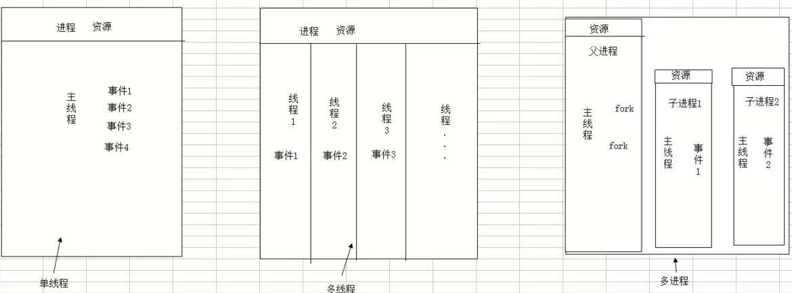
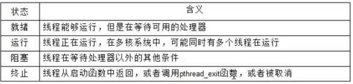
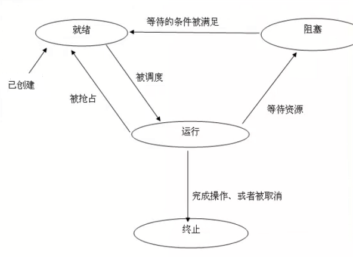
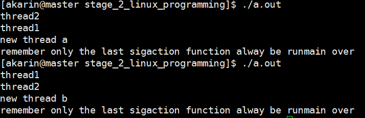

# 多线程

- 进程：一个正在执行的程序，它是**资源分配的最小单位**

进程中的事情需要按照一定顺序逐个执行，那么如何让一个进程中的一些事情同步执行


- 线程： 又称为轻量进程，**程序执行的最小单位**， 系统 **独立调度和分派cpu**的基本单位，是进程中的一个实体。
- 一个进程可以有多个线程，这些线程共享进程的所有资源，线程本身只包含一点必不可少的资源。

进程出现很多弊端，一是由于进程是资源拥有者，创建、撤销与切换存在较大的时空开销，因此需要引入轻型进程；二是由于对称多处理机（SMP）出现，可以满足多个运行单位，而多个进程并行开销过大。





## 操作系统的概念

### 并发

并发是指在同一时刻，只能有一条指令执行，但是多个进程被快速轮换执行，使得在宏观上具有多个进程同时执行的效果。 

在单核上看起来是同时发生。

### 并行

并行是指在同一时刻，有多条指令在多个处理器上同时执行

真正的同时发生

### 同步

同步：彼此有依赖关系的调用不应该**同时发生**，而同步就是要阻止哪些**同时发生**的事情

### 异步

异步： 和同步相对，任何两个独立的操作都是异步的，它表明事情独立的发生


## 多线程的好处

1. 在多处理器中开发程序的并行性
2. 在等待慢速IO操作时，程序可以执行其他操作，提高并行性
3. 模块化的编程，能更清晰的表达程序中独立事件的关系，结构清晰
4. 占用较少的系统资源

**多线程不一定要多处理器**


#  线程的创作和生命

## 创造新线程

### 线程id

- 对比


|            |             线程             |        进程         |
| :--------: | :--------------------------: | :-----------------: |
| 标识符类型 |           pthead_t           | pid_t(unsigned int) |
|   获取id   | pthread_t pthread_self(void) |      getpid()       |
|    创建    |       pthread_create()       |       fork()        |

pthread_t:在freeBSD5.2和mac下的是**结构体**在linux下是**unsigned long** (/usr/include/bits/pthreadtypes.h)

### 创建线程 pthread_create

```c
#include <pthread.h>

int pthread_create(pthread_t *restrict tidp,
                  const pthread_attr_t *restrict altr,
                  void *(*start_routine)(void*),
                  void *restrict arg);
//tidp:新线程的id，如果成功则新线程的id会回填到tidp指向的内存
//altr: 线程属性（调度策略，继承性，分离性...)
// 回调函数(新线程要执行的函数)
//arg:回调函数的参数， 可以用结构体

//return: 成功0 失败返回错误码
```


//ps:对`void*(*start_routine)(void*)`的理解

一个指向形参为`void*`类型，返回类型为`void*`类型的函数的指针，指针名是start_routine。

### example

```c
#include <stdio.h>
#include <pthread.h>
#include <stdlib.h>

void return_id(void)
{
	pid_t pid;
	pthread_t tid;

	pid = getpid();
	tid = pthread_self();
	printf("pid_t is %u, pthread_t is %x\n",pid, tid);
	return;
}

void *func(void *msg)
{
	printf("other thread\n");
	return_id();
	return (void*)0;
}

int main()
{
	pthread_t tid;
	int err;
	err = pthread_create(&tid, NULL, func, NULL);
	if (err != 0)
	{
		printf("pthread_create failure\n");
		return -1;
	}
	printf("main thread\n");
	return_id();
	sleep(3);
	return 0;
}
```


## 线程的生命周期

### 初始线程/主线程

1. main函数首先运行，在线程代码种，这个特殊的执行流被称作**初始线程**或**主线程**。可以在主线程中做任何普通线程可以做的事
2. 主线程的特殊性在于，在main函数返回的时候，会导致进程结束，进程内所有的线程也将会结束。可以在主线程中调用 `pthread_exit`函数，这样进程就会等待所有线程结束时才终止
3. 主线程接收的参数的方式是argc，argv，普通的线程只有一个void*
4. 在绝大多数情况下，主线程在默认堆栈上运行，可以增长到足够的长度。普通线程的堆栈是受限制的，溢出会产生错误

### 主线程的创建

1. 主线程是随着进程的创建而创建
2. 其他线程主要通过调用pthread_create
3. 新线程可能在当前进程调用pthread_create前就在运行，甚至在后者返回前就运行完毕

### example

```c
#include <stdio.h>
#include <string.h>
#include <pthread.h>
#include <stdlib.h>

struct person
{
	char name[10];
	unsigned int age;
};

void *func(void *person)
{
	sleep(1);
	printf("person name is %s, age is %u\n",
	((struct person *)person)->name, ((struct person*)person)->age);
	return (void *)0;
}
int main(int ac, char **av)
{
	pthread_t tid;
	int err;
	int *val; //for pthread_exit()
	struct person one;
	memcpy(one.name, "LEE", 10);
	one.age = 20;
	err = pthread_create(&tid, NULL, func, (void*)&one);
	if (err != 0)
	{
		printf("pthread_create failure\n");
		return -1;
	}
	printf("main thread\n");
	pthread_exit(val);
	return 0;
}

```


### 线程的四个基本状态



- 就绪
  - 当线程刚被创建时
  - 当线程被解除阻塞后
  - 就绪的线程在等待一个可用的处理器，当一个运行的线程被抢占时，立刻回到就绪状态
- 运行
  - 当处理器选中一个就绪的线程执行时，立刻变成运行状态
- 阻塞
  - 视图加锁一个已经被锁住的互斥量
  - 等待某个条件变量
  - 调用sigwait等待尚未发生的信号
  - 执行无法完成的I/O信号
  - 内存页错误
- 终止
  - 线程通常由于启动函数返回终止自己
  - 调用pthread_exit
  - 取消线程



### 终止

- 线程的分离
  - 分离一个正在运行的线程并不会影响它，仅仅是通知当前系统当该线程结束时，其所属的资源可以回收
  - 未被分离的线程在终止时hi保留它的虚拟内存，包括他们的堆栈和其他系统资源，有时这种线程被称为僵尸进程
  - **创建线程时默认是非分离的**
- 回收
  - 如果线程具有分离属性，线程终止时会立刻回收。
  - 回收将释放所有在线程终止时未释放的系统资源和进程资源，包括保存线程返回值的内存空间、堆栈、保存寄存器的内存空间等
  - **但是必须释放由线程占有的程序资源**
    - malloc和mmap分配的资源可以**在任何时候由任何线程释放**
    - 条件变量，忽视了，信号灯可以由任何线程销毁，**只要被解锁或者无线程等待**
    - **但是只有互斥量的主人才能解锁它，所以在线程终止前，需要解锁互斥量**


# 线程的基本控制

## 线程的终止

### 注意exit

如果进程中任意一个线程调用了exit，_Exit(), _exit()，**那么整个进程将会终止**

### 不终止进程的退出方式

普通的单个线程

1. 从启动例程中返回，返回值是线程的退出码
2. 线程可以被同一进程中的其他线程取消
3. 线程调用pthread_exit(void *rval)函数，rval是退出码

#### example

```c
#include <stdio.h>
#include <pthread.h>
#include <string.h>
#include <stdlib.h>

void *func(void *command)
{
	if (strcmp("a", (char*)command) == 0)
	{
		printf("return\n");
		return (void*)0;
	}

	if (strcmp("b", (char*)command) == 0)
	{
		printf("pthread_exit\n");
		pthread_exit((void*)1);
	}
	
	if (strcmp("c", (char *)command) == 0)
	{
		printf("exit\n");
		exit(0);
	}

}
int main(int ac, char **av)
{

	pthread_t tid;
	int err;
	err = pthread_create(&tid, NULL, func, (void*)av[1]);
	if (err != 0)
	{
		printf("pthread_create failre\n");
		return -1;
	}
	printf("main thread\n");
	sleep(1);
	return 0;
}

```


### 线程连接 pthread_join

调用该函数的线程会一直阻塞，直到指定的线程调用pthread_exit，从启动例程返回或被取消

```c
#include <pthread.h>

int pthread_join(pthread_t tid, void *rval);

//tid:指定线程的id
//rval:指定线程的返回码，如果线程被取消，rval被置为PTHREAD_CANCLED

//return : 成功0 失败错误码
```


调用pthread_join会使**指定的线程处于分离状态**，如果指定线程已经处于分离状态，那么调用就会失败

pthread_detach可以分离一个线程，线程可以自己分离自己

`int pthread_detach(pthread_t thread);`


#### example

```c
#include <stdio.h>
#include <pthread.h>


void *func_return(void * mes)
{
	printf("func_return \n");
	return (void*)11;
}

void *func_exit(void *mes)
{
	printf("func_exit\n");
// 	pthread_detach(pthread_self()); //会让pthread_join失败
	pthread_exit((void*)22);
	
}
int main(void)
{
	pthread_t tid_return, tid_exit;
	void *rval;
	int err;

	err = pthread_create(&tid_return, NULL, func_return, NULL);
	if (err != 0)
	{
		printf("pthread_create tid_return failure\n");
		return -1;
	}
	err = pthread_create(&tid_exit, NULL, func_exit, NULL);
	if (err != 0)
	{
		printf("pthread_create tid_exit failure\n");
		return -2;
	}
	
	err = pthread_join(tid_return, &rval);
	if (err != 0)
	{
		printf("pthread_join tid_return failure\n");
		return -3;
	}
	printf("tid_return join return  is %d\n", err);
	printf("tid_return rval is %d\n", (int*)rval);
	err = pthread_join(tid_exit, &rval);
	if (err != 0)
	{
		printf("pthread_join tid_return failure\n");
		return -3;
	}

	printf("tid_exit join return  is %d\n", err);
	printf("tid_exit rval is %d\n", (int*)rval);

	return 0;
}

```


### 线程取消

#### 取消函数 pthread_cancel

```c
int pthread_cancel(pthread_t tid);

//return: 成功0
```

取消tid指定的线程，取消仅仅是发送请求，并不意味着等待线程终止，而且发送成功也不意味着tid一定会终止

#### 取消状态 pthread_setcancelstate

取消状态就是线程对取消信号的处理方式，忽略或响应。

线程创建时默认响应取消信号

```c
int pthread_setcancelstate(int state, int *oldsate);

//state有两种值：PTHREAD_CANCEL_ENABLE(缺省值) PTHREAD_CANCEL_DISABLE
```

设置本线程对cancel信号的反应

分别表示收到信号后设为CANCEL状态和忽略CANCEL信号继续运行

old_state如果不为NULL则存入原来的cancel状态以便恢复

#### 取消类型 pthread_setcanceltype

取消类型，是线程对取消信号的相应方式，立即取消或延时取消。

线程创建时默认延时取消。

```c
int pthread_setcanceltype(int type, int *oldtype);

//type: PTHREAD_CANCEL_DEFFERED 和PTHREAD_CANCEL_ASYNCHRONOUS
//表示 收到信号后继续运行至下一个取消点再退出 立即执行取消动作（退出）
```

仅当PTHREAD_CANCEL_ENABLE时有效

oldtype如果不为NULL则存入原来的取消动作类型值

#### 取消点

取消一个线程，它通常需要被取消线程的配合

线程在很多时候会查看自己是否有取消请求，如果有就主动退出，这些查看是否有取消的地方就是取消点。


很多地方都是包含取消点

pthread_join()

pthread_testcancel()

pthread_cond_wait()

pthread_cond_timedwait()

sem_wait();

sigwait()

write()

read()

大多数会阻塞的系统调用


#### example

```c
#include <stdio.h>
#include <pthread.h>

void *func(void *msg)
{
	int state;
	int type;
	state = pthread_setcancelstate(PTHREAD_CANCEL_DISABLE, NULL);
	printf("other thread is already cancel disable\n");

	printf("other thread sleep 4 seconds\n", i);
	sleep(4);
	//state = pthread_setcancelstate(PTHREAD_CANCEL_ENABLE, NULL); //到时vral 为 -1
	state = pthread_setcancelstate(PTHREAD_CANCEL_DISABLE, NULL); //到时rval 为 222

	printf("other thread is already cancel enable\n");
	
	type = pthread_setcanceltype(PTHREAD_CANCEL_ASYNCHRONOUS, NULL); //会立刻返回，下面的两句printf就无法输出，仅当PTHREAD_ENABLE生效
	printf("cancel point one\n");
	printf("cancel point two\n");
	
	return (void*)222;

}
int main(void)
{
	pthread_t tid;
	int err;
	int cval, jval;
	void **rval;
	err = pthread_create(&tid, NULL, func, NULL);
	if(err != 0)
	{
		printf("pthread  failed\n");
		return -1;
	}

	printf("pthread successful\n");
	cval = pthread_cancel(tid);  //请求取消
	if (cval != 0)
	{
		printf("pthread_cancel failed\n");
		return -2;
	}

	printf("pthread_cancel successful\n");
	jval = pthread_join(tid, rval);	//当前进程会阻塞，等待tid的线程pthread_exit.return.取消
	if (jval != 0)
	{
		printf("pthread_join failed\n");
		return -3;
	}
	printf("pthread_join successful\n");
	printf("jval is %d\n", jval);
	printf("rval is %d\n", (int*)(*rval));
	
	printf("wait two second\n");
	sleep(2);

	printf("main is before return 0\n");
	return 0;
}
```


### 向线程发送信号

#### pthread_kill

```c
#include <signal.h>
int pthread_kill(pthread_t thread, int sig);
//return: 成功0， 出错错误码
```

向指定线程发送sig信号，如果线程代码内不作处理，则按照信号默认的行为影响整个进程，比如发送SIGUSR1，则默认退出进程

如果要获得正确的行为，则要在线程内实现sigaction

**sig不为0，则必须在线程内实现信号处理函数，否则会影响整个进程**

**sig为0，用于判断进程是否存活**

##### example

```c
#include <stdio.h>
#include <signal.h>
#include <pthread.h>
#include <errno.h>
void *func1(void *msg)
{
	printf("i am other thread\n");
	return (void*)222;
	
}


void *func2(void *msg)
{
	sleep(1);
	printf("i am other thread two\n");
	return (void *)333;
}
int main()
{
	pthread_t tid1, tid2;
	int err;
	void *rval;
	//thread one
	err = pthread_create(&tid1, NULL, func1, NULL);
	if (err < 0)
	{
		printf("pthread_create failed\n");
		return -1;
	}
	
	sleep(1);
	err = pthread_kill(tid1, 0);
	if (err == ESRCH)
		printf("tid1 thread not found\n"); //1s后tid1结束，会打印这句
	else
		printf("tid2 thread are found\n");

	//thread two
	err = pthread_create(&tid2, NULL, func2, NULL);
	if (err < 0)
	{
		printf("tid2 pthread_create failed\n");
		return -1;
	}
	
	err = pthread_kill(tid2, 0);
	if (err == ESRCH)
		printf("tid2 thread not found\n");
	else
		printf("tid2 thread are found\n"); //由于tid2等待了1s，所以打印这个

	err = pthread_kill(tid2, SIGQUIT); //func2没有sigaction，会直接退出，不会打印main function over
	

	pthread_join(tid2, &rval); //等待tid2，否则直接main函数退出
	printf("rval is %d\n", (int*)rval);

	//over
	printf("main function over\n");
	return 0;
}
```


#### 信号处理 sigaction

- 进程信号处理

```c
int sigaction(int signum, const struct sigaction *act, struct sigaction *oldact);

/*
struct siaction
{
	...
	act.sa_mask 信号屏蔽字
	act.sa_handler 信号集处理程序
	... 
}
```


```c
int sigemptyset(sigset_t *set); //清空信号集
int sigfillset(sigset_t *set);	//将所有信号加入信号集
int sigaddset(sigset_t *set, int signum); //增加一个信号到信号集
int sigdelset(sigset_t *set, int signum); // 删除一个信号到信号集
```


- 多线程信号屏蔽处理

  ```c
  //int sigprocmask(int how, const sigset_t *set, sigset_t *oldset); // 已失效
  
  int pthread_sigmask(int how, const sigset_t *set, sigset_t *oldset);
  // how: SIG_BLO.sa_miaCK 向当前的信号掩码中添加set，其中set表示要阻塞的信号组
  //		SIG_UNBLOCK 向当前的信号掩码中删除set， 其中set表示要取消阻塞的信号组
  //		SIG_SETMASK 向当前的信号掩码替换为set， 其中set表示新的信号掩码
  
  //return： 成功0 出错错误码
  ```

  在多线程中，新线程的当前信号掩码会继承创造它的那个线程的信号掩码

  一般情况下，被阻塞的信号将不能终端此线程的执行，除非此信号的产生是因为程序运行出错，比如SIGSEGV

  另外不能忽略处理的信号SIGKILL和SIGSTOP，这两个也不能被阻塞


##### example

```c
#include <stdio.h>
#include <pthread.h>
#include <signal.h>

void sig_handler1(int arg)
{
	printf("new thread a\n");
	printf("remember only the last sigaction function alway be run");
	return;
}

void sig_handler2(int arg)
{
	printf("new thread b\n");
	printf("remember only the last sigaction function alway be run");
	return;
}

void *thread1(void *msg)
{
	printf("thread1\n");
	struct sigaction act;
	//init
	sigaddset(&act.sa_mask, SIGQUIT); //信号屏蔽字
	act.sa_handler = sig_handler1;//信号集处理函数
	//注册
	sigaction(SIGQUIT,&act, NULL ); 

	//多线程屏蔽处理
	pthread_sigmask(SIG_BLOCK, &act.sa_mask, NULL);

	sleep(1);
}


void *thread2(void *msg)
{
	printf("thread2\n");
	struct sigaction act;
	//init
	sigaddset(&act.sa_mask, SIGQUIT); //信号屏蔽字
	act.sa_handler = sig_handler2;//信号集处理函数
	//注册
	sigaction(SIGQUIT,&act, NULL ); 

	//多线程屏蔽处理
	//pthread_sigmask(SIG_BLOCK, &act.sa_mask, NULL);

	sleep(1);
}

int main()
{
	pthread_t tid1, tid2;
	int err;
	int ret;

	err = pthread_create(&tid1, NULL, thread1, NULL);
	if (err != 0)
	{
		printf("tid1 create failed\n");
		return -1;
	}

	err = pthread_create(&tid2, NULL, thread2, NULL);
	if (err != 0)
	{
		printf("tid2 create failed\n");
		return -1;
	}
	sleep(1);

	ret = pthread_kill(tid1, SIGQUIT);
	if (ret != 0)
	{
		printf("send signal to tid1 failed\n");
		return -2;
	}
	ret = pthread_kill(tid2, SIGQUIT);
	if (ret != 0)
	{
		printf("send signal to tid2 failed\n");
		return -2;
	}
    
// 防止退出程序
	ret = pthread_join(tid1, NULL);
	if (ret != 0)
	{
		printf("pthread_join tid1 failed\n");
		return -3;
	}
	ret = pthread_join(tid2, NULL);
	if (ret != 0)
	{
		printf("pthread_join tid2 failed\n");
		return -3;
	}
	printf("main over\n");
	return 0;

}

```

运行



注意sigaction和signal一样，是响应最后一个调用他们的，所以上面会出现不同结果

### 清除操作

