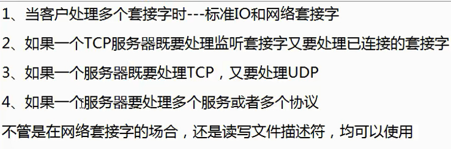

# 网络编程

## normal

### bind 注意

1. ip可以选择通配地址，端口号为0表示（内核分配临时端口）

2. INADDR_ANY，由内核选择ip端口，这个宏的值为0，于IPV4可行

3. 分配临时端口号，需要用函数getsockname，来返回协议地址

4. 绑定通常会返回错误

   `Address already in use`

   通过套接字选项来设置，setsockopt SO_REUSEADDR

地址重用

```c
setsockopt()
```


```c
inet_pton(AF_INET, "102.168.4.249", (struct sockattr_in) &a.sin_addr)
```


### 传递地址结构长度

- 从进程到内核传递地址结构的函数

  - bind
  - connect
  - sendto

- 从内核到进程传递地址结构的函数

  - accept

  - recvfrom

  - getsockname

  - getpeername


### 连接错误

1. 服务器主机上，没有相应的端口与之发生连接(服务器进程未启动)，称为硬错(hardware error), 收到RST，立马返回ECONNREFUSED
2. 在发送请求的时候当前IP不可达错误，协议ICMP，称为软错(sofware error), 比如 no route to host等等，通常是发送arp请求无响应


## select

  使用场合

  
