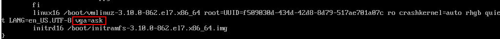

# list 1
- linux发行版使用一个表来管理在系统开机时要自动启动的进程。
	- 一般位于/etc/inittab中
	- ubuntu这些就采用 /etc/init.d目录，将开机时启动或停止某些应用的脚本放在该目录下。这些脚本通过/etc/rcX.d目录下的入口启动，这里的X表示运行级(run level)
- linux为系统上的每个设备都创建一种称为*节点*的特殊文件。每个*节点*都有唯一的数值对供linux内核标识。数值对包括一个主设备号和一个次设备号。主设备号为蓝本，次设备号为特定设备。
- linux内核采用Virtual FIle System(VFS)作为和每个文件系统交互的接口。当每个文件系统都被挂载和使用时，VFS将信息都缓存在内存中。
- GUN coreutils软件包
- shell

# list3
- 改变centos7的分辨率
	1. 更改 `/boot/grub2` 下的 `grub.cfg` 文件
	
    在`reboot`后可以选择分辨率
- ls
    - -R 递归
    - -F 区分文件和目录
    - -d 只显示目录信息，不列出其中的内容
    - 过滤输出列表
        - ? 此处的单个字符，可多次使用
        - \* 此处开始单个或多个字符
        - [abc] 此处可能出现的单字符abc
        - [a-c] 此处可能出现的单字符a-c
        - !x 排除x
- cp
    - -i 询问是否overwrite
    - -R 递归
- 链接文件
保存一份物理文件副本和多个虚拟副本的方法为链接。
	- 符号链接 在不同存储媒体的文件之间创建链接仅可使用该种链接
	`ln -s 被链接文件 链接名` 使用 `ls -li`查看inode编号(标识的唯一数字)
    大小inode编号不同
	- 硬链接 只能同存储媒体的文件之间创建链接
	`ln 被链接文件 硬链接名`
    属于同一个文件，共享inode编号
- mv
	不改变时间戳和inode编号。只改变名字和位置
    - -i 询问覆盖

- rm
	可使用通配符
- mkdir
    - -p 创建目录及其子目录

## 查看文件
- file 查看文件类型
- cat
    - -n 带行号
    - -T 不带制表符(^T替换所有的制表符)
- more
- less 更强

### 查看部分内容
- tail 默认最后10行
    - -n number 显示最后number行
    - -f 动态显示新内容
- head 默认开始10行
    - -n number 显示开始number行

# list 4
- ps 静态显示当前进程
    - f UNIX类型的详细内容
    - --forster 长指令类型的树结构查看
- top 实时监测进程
    - 键入f 设置显示的内容
    - 键入d 设置刷新时间
    - 键入q 退出top

- kill
	`kill pid` 向pid发送TERM信号(15)尽可能终止信号
    `kill -s 指定信号名称 pid`
- killall
	`killall 进程名称(支持通配符)`
- tar
    - c 创建tar归档文件
    - x 从tar归档文件提取文件
    - v 处理文件时显示文件
    - f 输出结果到文件或设备file
    - t list
    - `.tgz`可以使用`-zxvf`解压

# list 5
- 子shell，键入`bash`即有子shell
`ps -f --forest`查看子shell
- 进程模式
	- `ls ; ll ; pwd`命令列表
	- `(ls;ll;pwd)`进程列表，会创建一个子shell
	- `echo $BASH_SUBSHELL`查看是否存在子shell
	- `(echo $BASH_SUBSHELL)`会返回1
	- `(ls;(echo $BASH_SUBSHELL))`返回2
- 后台模式
    - 进程模式命令后面带个`&`
- 协程
    - `coproc 命令`
        - `jobs -l`查看会发现`coproc COPROC 命令`大写的是默认名
        - 可以使用`coproc 名字 { 命令; }`更改默认名，注意`命令;`和花括号左右各有一个空格
	- `coproc (sleep 3; sleep 5)`会新建一个子shell来执行这些后台命令

## shell外部和内建命令
外部命令需要新建一个子进程来执行
- `which command`查看外部命令
- `type -a command`查看外部命令和内建命令
- `alias -p`查看别名
- `alias name=r'ead_command'`新建临时 