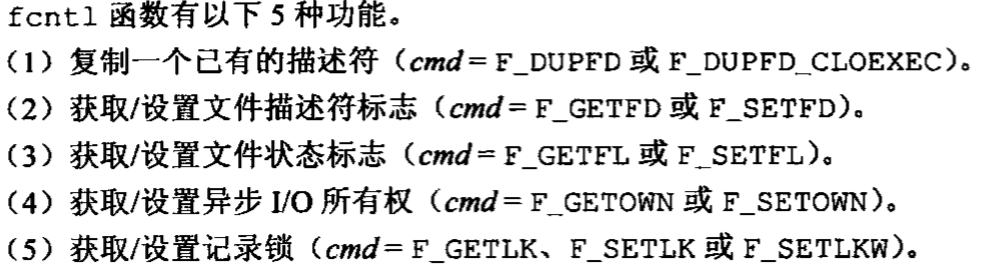
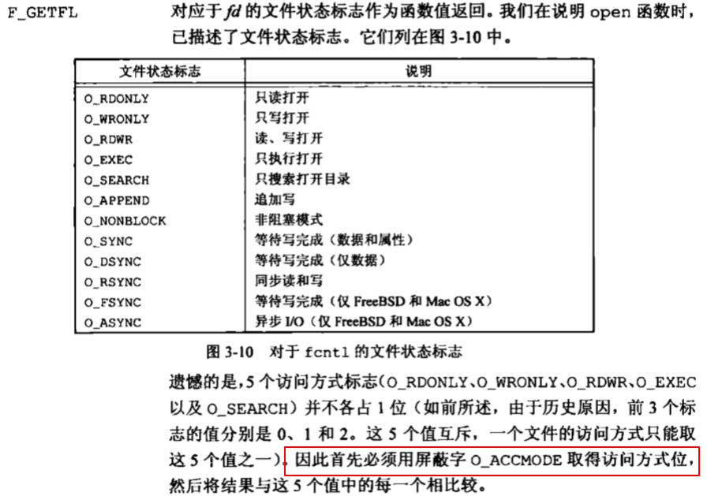

#list3
- 不带缓存的I/O函数不是ISO C的组成部分，但是是POSIX.1和Single UNIX Specification的组成部分。
## 文件描述符
文件描述符1 --- STDIN_FILENO
文件描述符2 --- STDOUT_FILENO
文件描述符3 --- STDERR_FILENO
above is defined in <unistd.h>
- 范围是0~OPEN_MAX-1
### open, openat
```c
	#include <fcntl.h>
    int open(const char *path, int oflag, .../* mode_t mode*/);
    int openat(int fd, const chat *path, int oflag, ... /*mode_t mode*/);
    //return -1 if fail, return fd if success
    //ISO C 用... 表面余下的参数的数量以及类型是可变的
    //对于open，仅当创建新文件时才使用最后的参数
```
- path参数是要打开或创建文件的名字
- oflag为选项(defined in <fcntl.h>),可选选项可以`|`起来
    - 必须指定且只能一个
        - O_RDONLY 只读打开 -- 0
        - O_WRONLY 只写打开 -- 1
        - O_RWWR 读写打开 -- 2
        - O_EXEC 只执行打开
        - O_SEARCH 搜索打开
	- 可选选项
        - O_CREAT 文件不存在则创建他，open和openat需要指定mode_t，即访问权限位UGO
        - O_TRUNC 如果文件存在，且只读或只写成功打开，将其长度截断为0
        - skip

### creat
```c
	#include <fcntl.h>
    int creat(const char *path, mode_t mode);
    //return -1 if fail, return fd if success
    //same as
    open(path, O_WRONLY|O_CREAT|O_TRUNC, mode);
```
- 缺陷 creat以只写方式打开所创建的文件，要读文件还需要open，可以使用`open(path, O_WRONLY|O_CREAT|O_TRUNC, mode);`来避免

### close
```c
	#include <uinstd.h>
    int close(int fd);
    /return -1 if fail, return 0 if success
```
- 关闭一个文件还会释放该进程加在该文件上的所有记录锁
- 进程终止时，内核自动关闭它所有的打开文件。可以使用exit(0)而不使用close

### lseek
- 每个打开文件都有相关联的current file offset，是一个非负整数。
- 通常，读写操作都从当前文件偏移量处开始，并使偏移量增加所读写的数量。
- 系统默认打开文件时，除非指定O_APPEND选项，否则偏移值为0
- 使用lseek显式地为一个打开文件设置偏移量
		#include <uinstd.h>
   ​     off_t lseek(int fd, off_t offset, int whence);
   ​     ///return -1 if fail, return new file offset if success

|whence值|效果|
|-|
|SEEK_SET|偏移量设置为距文件开始处offset个字节|
|SEEK_CUR|偏移量设置为其当前值加offset个字节，offset可正可负|
|SEEK_END|偏移量设置为文件长度加offset个字节，offset可正可负|
```c
	off_t currpos;
    currpos = lseek(fd, 0, SEEK_CUR);
    //确认当前偏移值
    // 也可以测试涉及的文件是否可以设置偏移量。如果文件是管道、FIFO、网络套接字，则lseek返回-1，并将errno设置为ESPIPE，见03/3-1-lseek.c
```
**比较时要测试它是否等于-1**

### read
```c
#include <unistd.h>
ssize_t read(int fd, const void *buf, size_t nbytes);
```

### write
```c
#include <unistd.h>
ssize_t write(int fd, const void *buf, size_t nbytes);
```
- write出错的常见原因是磁盘写满，或者超狗了一个给定进程的文件长度限制

### dup和dup2
```c
	#include <unistd.h>
    int dup(int fd);
    int dup2(int fd, int fd2);
    // return -1 or new file descriptor
```
- dup返回的new file descriptor一定是当前可用的file descriptor中最小值
- fd2 指定新descriptor的值，如果fd2已经打开，则先关闭它。如果fd==fd2，那么返回fd2.否则fd2的FD_CLOEXEC 文件标志会被清除，那么fd在进程调用exec时是打开状态的。
- 返回值和fd共享一个文件表项
- dup(fd) == fcntl(fd,F_DUPFD,0)
- dup2(fd,fd2) ~= close(fd2); fcntl(fd,F_DUPFD, fd2); // 非原子操作，且dup2和fcntl有一二些不同的errno

### sync，fsync,fdatasync
```c
	#include <unistd.h>
    int fsync(int fd);
    int fdatasync(int fd);
    //return -1 or 0
    void sync(void);
```
- sync将所有修改过的块缓存区排入写队列，然后就返回，不等待实际写磁盘操作结束，
- fsync对fd指定的文件起作用，也可以用于数据库这样的应用程序，都需要等待等待写磁盘操作结束才返回。
- fdatasync类似fsync，但是只影响文件的数据部分。so，fsync还会同步更新文件属性。

### fcntl
- 修改已经打开文件的属性
```c
		#include<fcntl.h>
        int fcntl(int fd, int cmd, ... /*int arg*/);
        //return -1 or apply to cmd
```
- arg和记录锁有关




