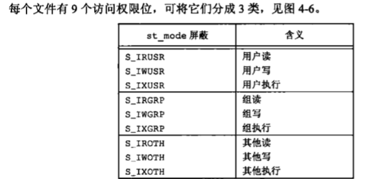
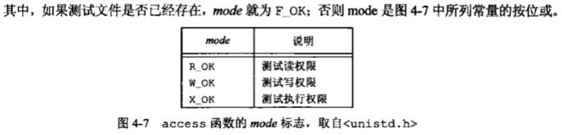

#list 4
### 文件访问权限

### access, faccessat
		#include <unistd.h>
        int access(const char *pathname, int mode);
        int faccessat(int fd, const char *pathname, int mode, int flag);
        //return -1 or 0

- 实际id 当前登陆的uid/gid，标识我是谁
- 有效id 进程用来决定我们对资源的访问权限 一般等于实际id，但是设置了suid等后，有效id变成文件拥有者id
    - **比如chown root a.txt 后， a.txt的有效id还不是root，任何执行a.txt的进程的有效用户还是其实际用户，如果设置了suid(chmod u+s a.txt)，那么执行a.txt的进程的有效用户就是root了。**

### chmod fchmod fchmodat
		#include <sys/stat.h>
        int chmod (cost char*pathname, mode_t mode);
        int fchmod(int fd, mode_t mode);
        int fchmoda(int fd, const char *pathname, mode_t mode, int flga);
        //return -1 or 0